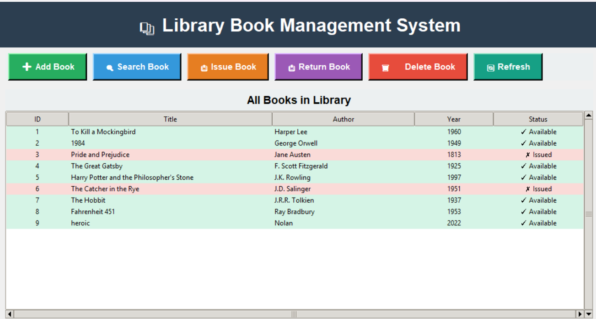
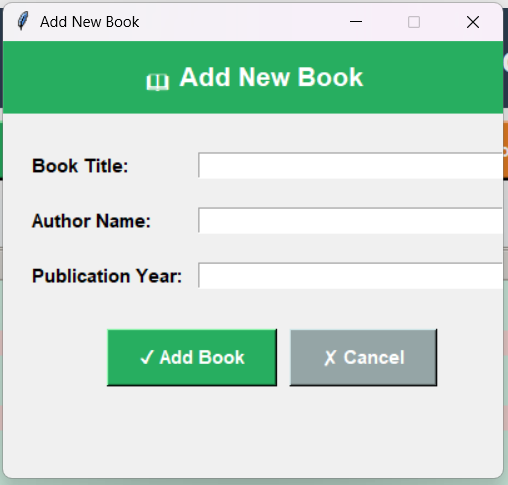
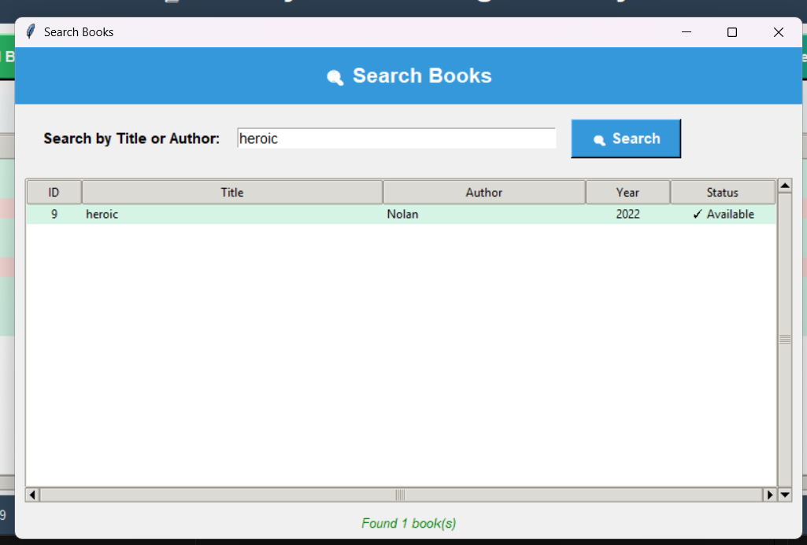
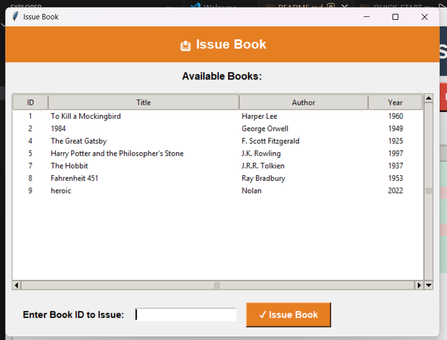
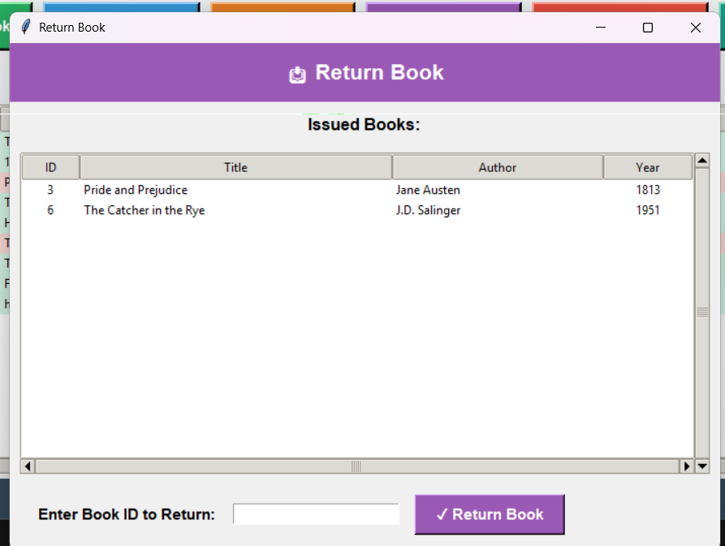
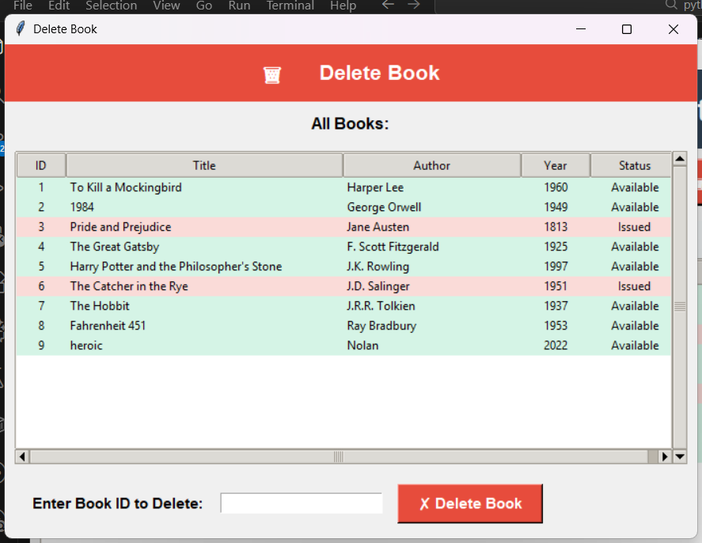

# 📚 Library Book Management System

A fully interactive **Tkinter-based GUI application** for managing library books using **Python** and **JSON file storage**. Features a modern interface with color-coded status indicators, complete CRUD operations, search functionality, and robust error handling.

<div align="center">



</div>

## ✨ Features

- 🎨 **Modern GUI Interface** — Clean, intuitive design with Tkinter
- ➕ **Add Books** — Complete validation for title, author, and year
- 🔍 **Smart Search** — Find books by title or author instantly
- 📤 **Issue Books** — Track book lending with availability status
- 📥 **Return Books** — Simple return process with status updates
- 🗑️ **Delete Books** — Remove books with confirmation dialogs
- 💾 **Auto-save** — Persistent JSON database storage
- 🎯 **Error Handling** — User-friendly validation and error messages
- 🌈 **Color Coding** — Green for available, red for issued books
- ⌨️ **Keyboard Support** — Press Enter to submit any form

## 🚀 Quick Start

### Requirements

- Python 3.6 or higher (Tkinter included)

### Run the Application

**GUI Version (Recommended):**
```bash
python gui_main.py
```

**Console Version:**
```bash
python main.py
```

## 📸 Application Screenshots

<table>
  <tr>
    <td align="center"><b>➕ Add New Book</b></td>
    <td align="center"><b>🔍 Search Books</b></td>
  </tr>
  <tr>
    <td></td>
    <td></td>
  </tr>
  <tr>
    <td align="center"><b>📤 Issue a Book</b></td>
    <td align="center"><b>📥 Return a Book</b></td>
  </tr>
  <tr>
    <td></td>
    <td></td>
  </tr>
  <tr>
    <td colspan="2" align="center"><b>🗑️ Delete a Book</b></td>
  </tr>
  <tr>
    <td colspan="2" align="center"></td>
  </tr>
</table>

## 🎯 How It Works

### Color-Coded Status

- 🟢 **Green** — Book is available
- 🔴 **Red** — Book is currently issued

### Smart Features

- Auto-generates unique Book IDs
- Validates all inputs (no empty fields, valid years)
- Keyboard shortcuts (Enter to submit forms)
- Auto-saves all changes to JSON
- Confirmation dialogs prevent accidental deletions
- Real-time status updates

## 💾 Data Structure

Books are stored in `books.json` with the following structure:

```json
{
  "id": 1,
  "title": "Book Title",
  "author": "Author Name",
  "year": 2024,
  "available": true
}
```

**Included:** 8 classic books pre-loaded for testing!

## 🔧 Technical Stack

| Component | Technology |
|-----------|------------|
| **Language** | Python 3.6+ |
| **GUI Framework** | Tkinter + ttk widgets |
| **Database** | JSON file storage |
| **Architecture** | MVC pattern with separated logic |

### Key Functions

- `load_data()` — Load books from JSON
- `save_data()` — Save books to JSON  
- `add_book()` — Add new book with validation
- `search_book()` — Case-insensitive search
- `issue_book()` — Mark book as issued
- `return_book()` — Mark book as available
- `delete_book()` — Remove book with confirmation

## 📁 Project Structure

```
Library-Book-Management-System/
├── gui_main.py          # Main GUI application
├── main.py              # Console version (Phase 1)
├── books.json           # Book database
├── README.md            # Documentation
├── LICENSE              # MIT License
└── images/              # Application screenshots
    ├── mainpage.png     # Main interface
    ├── AddBook.png      # Add book form
    ├── search.png       # Search functionality
    ├── issue.png        # Issue book window
    ├── return.png       # Return book window
    └── delete.png       # Delete confirmation
```

## 🐛 Troubleshooting

| Issue | Solution |
|-------|----------|
| **App won't start** | Verify Python 3.6+: `python --version` |
| **JSON corrupted** | Delete `books.json` and restart (auto-regenerates) |
| **Changes not saving** | Check file write permissions |
| **Tkinter missing** | Reinstall Python with tkinter support |
| **Import errors** | Uses only standard library — no pip install needed |

## ✨ Key Highlights

✅ **Full CRUD Operations** — Create, Read, Update, Delete

✅ **Input Validation** — Comprehensive error checking

✅ **Visual Feedback** — Color-coded availability status

✅ **Search Capability** — Fast title/author search

✅ **Persistent Storage** — Auto-save to JSON

✅ **User-Friendly** — Intuitive interface with clear messages

✅ **Keyboard Support** — Enter key shortcuts throughout

## 📄 License

This project is licensed under the **MIT License** - see the [LICENSE](LICENSE) file for details.

Free to use, modify, and distribute for educational and commercial purposes.

## 👨‍💻 Author

**Soumaditya Kashyap**

Created as part of the **L&T Python Training Project**

---

<div align="center">

### ⭐ Star this repo if you found it helpful!

**Made with ❤️ using Python & Tkinter**

</div>
